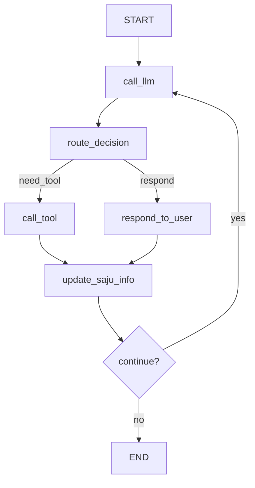

# P03: 시스템 아키텍처 (System Architecture)

## 🏗️ 전체 아키텍처 개요

사주 챗봇 시스템은 **마이크로서비스 지향 모놀리스** 패턴을 채택하여 모듈간 느슨한 결합을 유지하면서도 단일 배포 단위로 관리됩니다.

### 아키텍처 원칙
- **단일 책임 원칙**: 각 모듈은 명확한 책임을 가짐
- **의존성 역전**: 인터페이스를 통한 느슨한 결합
- **계층 분리**: 프레젠테이션, 비즈니스, 데이터 계층 분리
- **상태 관리**: 명시적 상태 전이를 통한 예측 가능한 동작

## 📐 계층별 아키텍처

```
┌─────────────────────────────────────────────────────────────┐
│                    Presentation Layer                       │
├─────────────────────┬─────────────────────┬─────────────────┤
│     FastAPI         │    Console CLI      │   Future Web    │
│   REST Endpoints    │   (main.py)         │      UI         │
└─────────────────────┴─────────────────────┴─────────────────┘
                              │
┌─────────────────────────────────────────────────────────────┐
│                   Workflow Layer                            │
├─────────────────────────────────────────────────────────────┤
│                    LangGraph Engine                         │
│  ┌─────────────┐ ┌─────────────┐ ┌─────────────────────────┐ │
│  │ call_llm    │→│ route_      │→│ call_tool /             │ │
│  │             │ │ decision    │ │ respond_to_user         │ │
│  └─────────────┘ └─────────────┘ └─────────────────────────┘ │
│                              ↓                             │
│                  ┌─────────────────────────┐                │
│                  │ update_saju_info        │                │
│                  └─────────────────────────┘                │
└─────────────────────────────────────────────────────────────┘
                              │
┌─────────────────────────────────────────────────────────────┐
│                   Business Layer                            │
├─────────────────┬─────────────────┬─────────────────────────┤
│ Saju Calculator │ Saju Analyzer   │ Saju Interpreter        │
│ (core/saju_     │ (core/saju_     │ (core/saju_             │
│  calculator.py) │  analyzer.py)   │  interpreter.py)        │
├─────────────────┼─────────────────┼─────────────────────────┤
│ • 천간지지 계산  │ • 오행 분석      │ • LLM 기반 해석          │
│ • 음력 변환     │ • 십성 분석      │ • 자연어 생성            │
│ • 절기 계산     │ • 신살 추출      │ • 컨텍스트 관리          │
└─────────────────┴─────────────────┴─────────────────────────┘
                              │
┌─────────────────────────────────────────────────────────────┐
│                     Data Layer                              │
├─────────────────────────┬───────────────────────────────────┤
│      Session Store      │        Knowledge Base             │
│     (MySQL)             │       (ChromaDB)                  │
├─────────────────────────┼───────────────────────────────────┤
│ • 사용자 세션           │ • 사주 용어 벡터                   │
│ • 대화 히스토리         │ • 해석 규칙 벡터                   │
│ • 계산된 사주 데이터    │ • 한국어 임베딩                    │
└─────────────────────────┴───────────────────────────────────┘
```

## 🔄 LangGraph 워크플로우 상세

### 상태 그래프 구조



### 노드별 책임

#### 1. call_llm
```python
def call_llm(state: AgentState) -> AgentState:
    """
    역할: OpenAI GPT-4와 상호작용
    입력: 사용자 메시지, 대화 컨텍스트
    출력: LLM 응답 (도구 호출 포함 가능)
    """
```

#### 2. route_decision
```python
def route_decision(state: AgentState) -> Literal["call_tool", "respond_to_user"]:
    """
    역할: LLM 응답에 따른 라우팅 결정
    조건:
    - tool_calls 존재 → call_tool
    - 일반 응답 → respond_to_user
    """
```

#### 3. call_tool
```python
def call_tool(state: AgentState) -> AgentState:
    """
    역할: 사주 계산 도구 실행
    지원 도구:
    - calculate_saju: 사주 계산
    - analyze_saju: 오행/십성 분석
    - search_knowledge: 지식 검색
    """
```

#### 4. update_saju_info
```python
def update_saju_info(state: AgentState) -> AgentState:
    """
    역할: 상태 정보 업데이트 및 세션 저장
    - 계산된 사주 정보를 상태에 저장
    - MySQL에 세션 데이터 영속화
    """
```

## 🎯 상태 관리 설계

### AgentState 구조
```python
@dataclass
class AgentState:
    # 기본 대화 정보
    messages: List[BaseMessage]
    user_id: str
    session_id: str

    # 사용자 정보
    user_birth_info: Optional[Dict] = None

    # 계산된 사주 데이터
    calculated_saju: Optional[Dict] = None
    analyzed_saju: Optional[Dict] = None

    # 메타데이터
    last_activity: datetime = field(default_factory=datetime.now)
    conversation_context: Dict = field(default_factory=dict)
```

### 상태 전이 규칙
1. **초기 상태**: 사용자 정보만 존재
2. **생년월일시 수집**: `user_birth_info` 업데이트
3. **사주 계산**: `calculated_saju` 생성
4. **사주 분석**: `analyzed_saju` 생성
5. **해석 제공**: 컨텍스트 기반 응답

## 🔌 모듈 간 통신

### 인터페이스 정의

#### ISajuCalculator
```python
from abc import ABC, abstractmethod
from datetime import datetime
from typing import Dict

class ISajuCalculator(ABC):
    @abstractmethod
    def calculate_saju(self, birth_datetime: datetime) -> Dict:
        """생년월일시로부터 사주 계산"""
        pass

    @abstractmethod
    def get_lunar_date(self, solar_date: datetime) -> Dict:
        """양력을 음력으로 변환"""
        pass
```

#### ISajuAnalyzer
```python
class ISajuAnalyzer(ABC):
    @abstractmethod
    def analyze_saju(self, saju_data: Dict) -> Dict:
        """사주 데이터 분석"""
        pass

    @abstractmethod
    def get_ohang_distribution(self, saju_data: Dict) -> Dict:
        """오행 분포 분석"""
        pass

    @abstractmethod
    def extract_shipsung(self, saju_data: Dict) -> Dict:
        """십성 추출"""
        pass
```

### 의존성 주입
```python
# dependency_injection.py
from typing import Protocol

class Dependencies:
    def __init__(self):
        self.calculator: ISajuCalculator = SajuCalculator()
        self.analyzer: ISajuAnalyzer = SajuAnalyzer()
        self.interpreter: ISajuInterpreter = SajuInterpreter()
        self.mysql_manager = MySQLManager()
        self.chroma_manager = ChromaManager()

# 전역 의존성 인스턴스
deps = Dependencies()
```

## 📊 데이터 플로우

### 1. 사용자 요청 처리
```
HTTP Request → FastAPI → LangGraph → Core Modules → Database
```

### 2. 사주 계산 플로우
```
생년월일시 입력 →
음력 변환 →
천간지지 계산 →
오행 분석 →
십성 분석 →
신살 추출 →
해석 생성
```

### 3. 지식 검색 플로우
```
사용자 질문 →
벡터 임베딩 →
ChromaDB 검색 →
관련 지식 추출 →
LLM 컨텍스트 제공
```

## 🔧 핵심 디자인 패턴

### 1. Factory Pattern
```python
class SajuToolFactory:
    @staticmethod
    def create_tool(tool_name: str) -> BaseTool:
        tools = {
            "calculate_saju": SajuCalculatorTool(),
            "analyze_saju": SajuAnalyzerTool(),
            "search_knowledge": KnowledgeSearchTool()
        }
        return tools.get(tool_name)
```

### 2. Strategy Pattern
```python
class InterpretationStrategy(ABC):
    @abstractmethod
    def interpret(self, saju_data: Dict) -> str:
        pass

class PersonalityInterpretation(InterpretationStrategy):
    def interpret(self, saju_data: Dict) -> str:
        # 성격 해석 로직
        pass

class FortuneInterpretation(InterpretationStrategy):
    def interpret(self, saju_data: Dict) -> str:
        # 운세 해석 로직
        pass
```

### 3. Observer Pattern
```python
class SessionObserver(ABC):
    @abstractmethod
    def on_session_update(self, session_data: Dict):
        pass

class DatabaseSessionObserver(SessionObserver):
    def on_session_update(self, session_data: Dict):
        # MySQL에 세션 저장
        pass

class CacheSessionObserver(SessionObserver):
    def on_session_update(self, session_data: Dict):
        # 캐시 업데이트
        pass
```

## 🚀 성능 최적화 아키텍처

### 1. 캐싱 전략
```
┌─────────────┐    ┌─────────────┐    ┌─────────────┐
│   Memory    │    │    Redis    │    │   Database  │
│   Cache     │    │   Cache     │    │             │
│  (1초 TTL)  │    │ (1시간 TTL) │    │ (영구저장)  │
└─────────────┘    └─────────────┘    └─────────────┘
```

### 2. 연결 풀링
```python
# MySQL 연결 풀
SQLALCHEMY_POOL_SIZE = 10
SQLALCHEMY_MAX_OVERFLOW = 20
SQLALCHEMY_POOL_RECYCLE = 3600

# ChromaDB 클라이언트 재사용
chroma_client = chromadb.PersistentClient(path="./chroma_db")
```

### 3. 비동기 처리
```python
# FastAPI 비동기 엔드포인트
@app.post("/chat/")
async def chat_endpoint(request: ChatRequest):
    # 비동기 처리로 동시성 향상
    result = await process_chat_async(request)
    return result
```

## 🔒 보안 아키텍처

### 1. 계층별 보안
```
┌─────────────────┐
│   API Gateway   │ ← Rate Limiting, Input Validation
├─────────────────┤
│ Business Logic  │ ← Data Sanitization, Access Control
├─────────────────┤
│   Data Layer    │ ← Encryption, Audit Logging
└─────────────────┘
```

### 2. 데이터 보호
```python
# 민감 정보 암호화
from cryptography.fernet import Fernet

class SecureBirthInfo:
    def __init__(self, key: bytes):
        self.cipher = Fernet(key)

    def encrypt_birth_data(self, birth_data: Dict) -> str:
        return self.cipher.encrypt(json.dumps(birth_data).encode())

    def decrypt_birth_data(self, encrypted_data: str) -> Dict:
        return json.loads(self.cipher.decrypt(encrypted_data).decode())
```

## 📈 확장성 고려사항

### 1. 수평 확장
- **Stateless 설계**: 세션 데이터는 외부 저장소에 보관
- **로드 밸런서**: 여러 인스턴스 간 요청 분산
- **데이터베이스 샤딩**: 사용자별 데이터 분산

### 2. 마이크로서비스 분리 준비
```
현재 모놀리스 → 향후 마이크로서비스
┌─────────────┐    ┌─────────────┐
│             │    │ Auth Service│
│             │    ├─────────────┤
│  Monolith   │ →  │ Saju Service│
│             │    ├─────────────┤
│             │    │ Chat Service│
└─────────────┘    └─────────────┘
```

### 3. 이벤트 기반 아키텍처 준비
```python
# 이벤트 발행/구독 준비
class EventBus:
    def publish(self, event: Event):
        # 향후 메시지 큐 연동
        pass

    def subscribe(self, event_type: str, handler: Callable):
        # 이벤트 핸들러 등록
        pass
```

## 🎨 아키텍처 품질 속성

### 1. 가용성 (Availability)
- **목표**: 99.9% uptime
- **전략**: Health check, Circuit breaker, Graceful shutdown

### 2. 성능 (Performance)
- **목표**: 평균 응답시간 < 2초
- **전략**: 캐싱, 연결 풀, 비동기 처리

### 3. 확장성 (Scalability)
- **목표**: 100+ 동시 사용자 지원
- **전략**: Stateless 설계, 데이터베이스 최적화

### 4. 유지보수성 (Maintainability)
- **목표**: 새 기능 추가 용이성
- **전략**: 모듈화, 인터페이스 분리, 테스트 커버리지

---

**다음 문서**: [P04: API 레퍼런스](p04_api_reference.md)
**관련 문서**: [P05: 핵심 모듈](p05_core_modules.md)